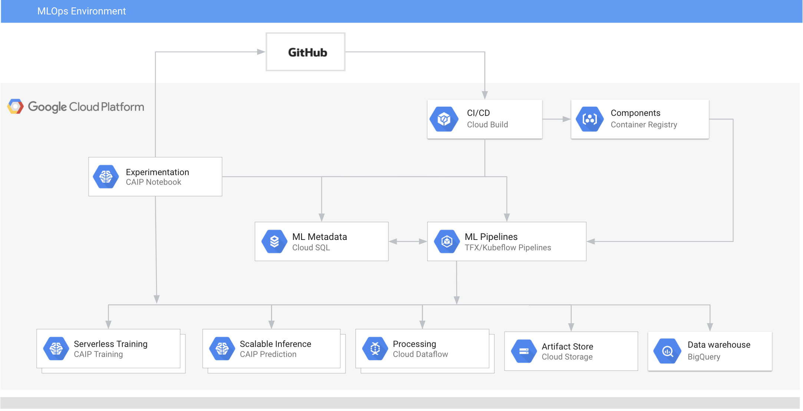
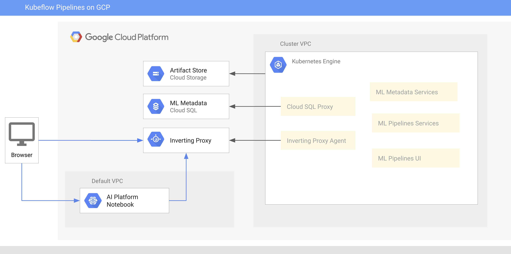

# Setting up an MLOps environment on GCP

This folder contains instructions that guide you through the process of setting up a GCP based MLOps environment as depicted on the below diagram.

The core services in the environment are:
- ML experimentation and development - AI Platform Notebooks 
- Scalable, serverless model training - AI Platform Training  
- Scalable, serverless model serving - AI Platform Prediction 
- Distributed data processing - Dataflow  
- Analytics data warehouse - BigQuery 
- Artifact store - Google Cloud Storage 
- Machine learning pipelines - Kubeflow Pipelines on GKE
- Machine learning metadata  management - ML Metadata on Cloud SQL
- CI/CD tooling - Cloud Build
    
In this environment, all services are provisioned in the same [Google Cloud Project](https://cloud.google.com/storage/docs/projects). 

An instance of **AI Platform Notebooks** is used as a primary experimentation/development workbench. The instance is configured using a custom container image that should be optimized for a given ML project. In this example, you will configure the instance optimized for developing Kubeflow Pipelines (KFP) and TensorFlow Extended (TFX) solutions. 

The environment uses a [standalone deployment of Kubeflow Pipelines on GKE](https://www.kubeflow.org/docs/pipelines/installation/standalone-deployment/), as depicted on the below diagram:

The KFP services are deployed to a GKE cluster and configured to use a Cloud SQL  instance for ML Metadata and Google Cloud Storage for artifact storage. The KFP services access the Cloud SQL through [Cloud SQL Proxy](https://cloud.google.com/sql/docs/mysql/sql-proxy). External clients use [Inverting Proxy](https://github.com/google/inverting-proxy) to interact with the KFP services.

The provisioning of the environment has been split into two hands-on labs.

In the first lab you create an instance of **AI Platform Notebooks**. In the second lab you provision other services comprising the environment, including a standalone deployment of **Kubeflow Pipelines**.

## [Creating an AI Platform Notebook instance](creating-notebook-instance/README.md)

## [Provisioning a standalone deployment of Kubeflow Pipelines](provisioning-kfp/README.md)

# Before you begin

You need to have **Project Owner**  permissions in your GCP project to walk through the labs.
