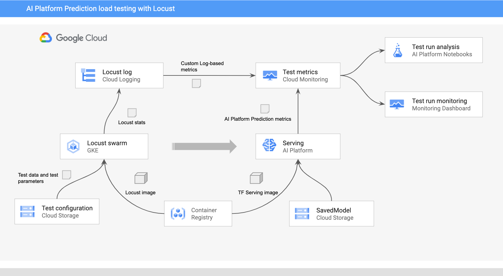

# Load Testing AI Platform Prediction for Online Serving

This directory contains code samples that demonstrate how to test and monitor AI Platform Prediction online serving performance with respect to
service latency and resources utilization. 

The code samples utilize the [ResNet101 image classification model](https://tfhub.dev/google/imagenet/resnet_v2_101/classification/4) from TensorFlow Hub. 
The design patterns and techniques demonstrated in the samples can be easily adapted to other domains and types of models.


We use [Locust](locust.io) to simulate the user prediction requests workload. 
The following diagram depicts the load testing environment utilized in this example.



## Overview
In the environment, Locust is run in a distributed mode on a GKE cluster. 
Locust's master and workers are deployed to the cluster as Kubernetes [Deployments](https://kubernetes.io/docs/concepts/workloads/controllers/deployment/) 
using a custom docker image dervied from the baseline [locustio/locust](https://hub.docker.com/r/locustio/locust) image. The custom image incorporates the [locustfile](locust/locust-image/task.py) script and its dependencies.

The script simulates calls to the `predict` method of the  AI Platform Prediction REST endpoint. 
The test parameters retrieved from a Cloud Storage location at the start of each test.

In addition to simulating requests, the script logs test statistics managed by the Locust master to [Cloud Logging](https://cloud.google.com/logging). 
The log entries created by the script are used to define a set of [Log-based metrics](https://cloud.google.com/logging/docs/logs-based-metrics) 
that complement standard [AI Platform Prediction metrics](https://cloud.google.com/monitoring/api/metrics_gcp#gcp-ml). 

Load tests can be configured, started, and stopped using **Locust's** [web interface](https://docs.locust.io/en/stable/quickstart.html#locust-s-web-interface). 
The **Locust's** web interface is enabled on the Locust master and exposed through a Kubernetes [Service](https://kubernetes.io/docs/concepts/services-networking/service/) 
configured as an external load balancer.

The progress of the tests can be monitored using [Locust's web interface](https://docs.locust.io/en/stable/quickstart.html#locust-s-web-interface) 
or a Cloud Monitoring [dashboard](https://cloud.google.com/monitoring/dashboards). 
The Cloud Monitoring dashboard combines the AI Platform Prediction metrics with the custom Locust log-based metrics.

## Directory contents
The load testing system is driven by the following three Notebooks:

* [01-prepare-and-deploy.ipynb](01-prepare-and-deploy.ipynb). This Notebook shows how to prepare a [TensorFlow SavedModel](https://www.tensorflow.org/guide/saved_model) for 
serving, and deploy it to AI Platform Prediction. The Notebook covers:
    1. Using pre-trained models from TensorFlow Hub
    2. Extending the pre-trained model with pre-processing and post-processing operations 
    3. Defining multiple serving signatures for the model and exporting it as a SavedModel
    4. Deploying the SavedModel to AI Platform Prediction with auto-scaling and GPUs
    5. Validate deployed model versions

* [02-perf-testing.ipynb](02-perf-testing.ipynb). This Notebook demonstrates how to use [Locust](locust.io), [Google Kubernetes Engine](https://cloud.google.com/kubernetes-engine) and [Cloud Monitoring](https://cloud.google.com/monitoring) to perform load testing of model versions deployed in AI Platform Prediction. 
The Notebook covers:
    1. Creating custom log-based metrics in [Cloud Monitoring](https://cloud.google.com/monitoring)
    2. Creating custom Cloud Monitoring dashboard
    3. Deploying Locust to a [GKE cluster](https://cloud.google.com/kubernetes-engine)
    4. Preparing and running load tests
    5. Retrieving and consolidating test results in DataFrame

* [03-analyze-results.ipynb](03-analyze-results.ipynb). This Notebook outlines techniques for analyzing load test results. 
The Notebook covers:
    1. Loading the DataFrame with the test results
    2. Aligning and normalizing metric time series
    3. Using Pandas and Matplotlib to analyze and visualize test results

In addition to the Notebooks, the directory includes the following artifacts:

* [monitoring-template.json](monitoring-template.json) - An example template of a custom [Cloud Monitoring dashboard](https://cloud.google.com/monitoring/dashboards) that displays both the standard [AI Platform Prediction metrics](https://cloud.google.com/monitoring/api/metrics_gcp#gcp-ml) and the custom [Cloud Logging log-based metrics](https://cloud.google.com/logging/docs/logs-based-metrics) for the Locust test logs.

* [locust](locust) - A folder containing [Kustomize](https://kustomize.io/) manifests to deploy Locust to a GKE cluster and a [locustfile](https://docs.locust.io/en/stable/writing-a-locustfile.html) script demonstrating how to load test the AI Platform Prediction REST API `predict` method.

* [test_images](test_images) - A folder contains sample image data for running the load test on the ResNet image classification model.


## Environment setup

1. Create a [Cloud Storage bucket](https://cloud.google.com/storage/docs/creating-buckets).
2. Create a [Cloud Monitoring Workspace](https://cloud.google.com/monitoring/workspaces/create) in your project.
3. Create a [Google Kubernetes Engine](https://cloud.google.com/kubernetes-engine/docs/how-to/creating-a-cluster) cluster with the required CPUs. 
The node pool must have access to the Cloud APIs.
    ```
    PROJECT_ID=[YOUR-GCP-PROJECT-ID]
    CLUSTER_NAME=[YOUR-CLUSTER-NAME]
    ZONE=[YOUR-CLUSTER-ZONE]
    MACHINE_TYPE=n1-standard-8
    SIZE=5

    gcloud beta container --project=$PROJECT clusters create $CLUSTER_NAME \
        --zone=$ZONE \
        --machine-type=$MACHINE_TYPE \
        --num-nodes=$SIZE \
        --scopes=cloud-platform 
     ```
4. Create an [AI Notebooks instance](https://cloud.google.com/ai-platform/notebooks/docs/create-new) TensorFlow 2.2.
5. Open the JupyterLab from the AI Notebook instance.
6. Open a new Terminal to execute the following commands to clone the repository:
    ```
    git clone https://github.com/GoogleCloudPlatform/mlops-on-gcp
    cd mlops-on-gcp/model_serving/caip-load-testing
    ```


